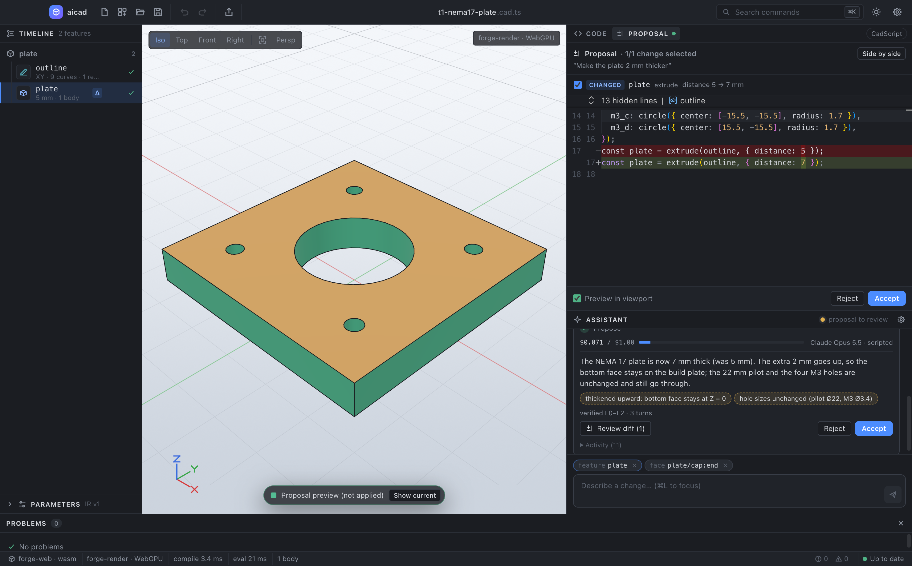

# The design agent in the desktop app

This doc covers how the Assistant panel runs `@aicad/agent` on the open document and hands back a reviewable **draft** (ARCHITECTURE §6–§7). It explains where the models come from (CLI agents on your own subscription, local models, or optional API keys; [ADR 0014](adr/0014-cli-agents-as-providers.md)), where keys are stored, and how to run the agent offline with the scripted transport or a fake CLI.



## Quick start

1. Run the app with `pnpm --filter @aicad/desktop dev`.
2. Have a model provider. **No API key is needed** if you already use one of these:
   - a CLI coding agent you are logged into: Claude Code (`claude`), Codex CLI, Gemini CLI or opencode. The app detects it and uses your own plan (see [Providers](#providers-cli-agents-local-models-and-optional-api-keys));
   - a local Ollama server with a tool-capable model (`ollama pull qwen3:8b`).

   Otherwise open **Settings** (⌘, or the gear icon) and paste an API key for Anthropic, OpenAI or Google Gemini, or point the app at an OpenAI-compatible endpoint. Settings shows what was found, e.g. "Using Claude Code (detected)".
3. Optionally select a face or feature, then type a request in the Assistant, e.g. "make the plate 2 mm thicker".
4. Follow the progress checklist, the cost meter and any questions. Then review the **Proposal** tab: the diff, the per-feature checkboxes and the viewport preview.
5. Click **Accept** (or **Accept n of m**). The change lands as **one undo step**, and ⌘Z reverts it.

## Process layout

```
renderer (sandboxed React app)            main process                         agent utility process
──────────────────────────────            ────────────                         ─────────────────────
AgentService + commands  ── invoke ──▶    AgentHost                ─ post ─▶  AgentRunner
 agent.run / stop / answer  agent:start    · validates requests (v1)            · LLMGateway (keys in memory,
 settings.*                 agent:answer   · settings + key store                 CLI transports, local models)
                            agent:stop     · CliDetector: CLI version,          · @aicad/agent (interactive)
                            settings:*       lockdown, login (no model call)    · Engine: forge-web WASM in
                                           · LocalModels: Ollama probe            Node → Forge CLI fallback
                                           · start precheck, keys per run       · CLI child processes, one per
                                           · forks / re-forks the worker          model call (own process group)
ProposalView, RunCard  ◀── agent:event ──  forwards events            ◀ post ─  events (phase, tool, llm,
viewport preview                           (+ crash / stop-timeout,             cost, plan, draft, question,
                                           plan-usage cache, CLI blocks)        result) + lockdown / pgid reports
```

**Why a utility process** (`utilityProcess.fork`) rather than the main process:
- An agent run compiles and type-checks CadScript (the TypeScript compiler) and evaluates Forge WASM, synchronously, often for seconds at a time. In the main process that would stall IPC, menus and the `app://` protocol for every window.
- A crash, OOM or runaway loop in a provider SDK or in WASM would take the whole app down. Here it only ends the run. The main process reports `WORKER_EXITED` to the renderer and forks a fresh process for the next run.
- The process gets a **sanitized environment**: no `*_API_KEY`, `*_TOKEN` or `*SECRET` variables. It receives only the keys a run needs, in the `start` message. Its own environment is the plain allowlist (`env.ts` `agentWorkerEnv`): no base-URL, Node, proxy or CA overrides. Where CLI agents keep their own logins (`XDG_*`, `CLAUDE_CONFIG_DIR`, `CODEX_HOME`, `GEMINI_CLI_HOME`: locations, never credentials) and the proxy and CA settings a CLI may need (`HTTPS_PROXY`, `NO_PROXY`, `SSL_CERT_*`, `NODE_EXTRA_CA_CERTS`) travel in the `start` message (`WorkerCliConfig.childEnv`) and reach **CLI children only**; the gateway allowlists again for every CLI child (docs/CLI-PROVIDERS.md §5.3). Trade-off: a CA or proxy set in the app's environment (for example with `launchctl setenv`) still reaches the CLIs, which need it behind a corporate proxy, but never the process that holds the API keys and makes the SDK calls.

The renderer stays sandboxed and CSP-locked (`connect-src 'self'`). It never talks to a provider.

**Engine.** The agent verifies every step (L0 compile → L1 kernel → L2 expectations → L3 tests) against `@aicad/forge-web`. That is the same WASM build the viewport uses, run in Node inside the utility process. If it is missing, the agent uses the native Forge CLI (`aicad`). With neither, the run stops with `engine_unavailable`.

## IPC protocol (version 1)

- **Where the types live:** `packages/app/src/agent-protocol.ts`, exported through `@aicad/app/bridge`.
- **Runtime validation:** `packages/desktop/src/agent/protocol.ts`.
- **Versioning:** every message carries `v: 1`. The main process rejects any other version, as well as unknown enums and oversize fields, and it drops unknown fields.

| Channel (renderer → main) | Request | Response |
|---|---|---|
| `agent:start` | `{ v, prompt, source, documentName, selection[{kind, ref, label, description}], process?, settings?{budgetUsd} }` | `{ ok: true, runId }` or `{ ok: false, code, message }` with `code` one of `NO_API_KEY`, `CLI_NOT_INSTALLED`, `CLI_UNSUPPORTED`, `CLI_BLOCKED`, `CLI_NOT_LOGGED_IN`, `LOCAL_UNAVAILABLE`, `BUSY`, `INVALID_REQUEST`, `UNAVAILABLE` |
| `agent:answer` | `{ v, runId, questionId, answers[] }` | `{ ok }` |
| `agent:stop` | `{ v, runId }` | `{ ok }` |
| `settings:get` / `settings:update` / `settings:setApiKey` / `settings:clearApiKey` | see `SettingsUpdate` (models, budget, compat URL, `cliPaths`, `cliMode`, `ollamaBaseUrl`), `SetApiKeyRequest`, … | `AgentSettingsView` (never contains a key or any CLI credential) |
| `settings:probeProviders` | `{ v, providers? }` | `AgentSettingsView`, after detecting the CLIs and Ollama again (no model call) |

`agent:event` (main → renderer) streams `AgentEvent`s. Each one carries `{ v, runId, seq, t }` plus one body:

| `type` | Meaning |
|---|---|
| `started` | Models per role, budget, transport (`live` \| `scripted` \| `replay`), engine |
| `phase` | Orchestrator state: TRIAGE, CLARIFY, SPEC, BUILD, REPAIR, REPLAN, PROPOSE, DONE, and its detail |
| `tool` / `llm` / `note` | Summarized tool calls, model calls with cost (and their `billing`: metered, subscription or local), orchestrator notes |
| `cost` | `spentUsd` and `budgetUsd` (the cost meter); `notional: true` when the spend is a CLI plan's list-price estimate |
| `plan` | Plan usage a CLI reported (Claude Code: 5-hour and 7-day windows) |
| `draft` | A CadScript snapshot after every apply or rollback (the live "Draft" tab) |
| `question` / `answered` | Clarifying questions with options and defaults. The 80 % budget checkpoint arrives as `kind: "budget"` |
| `result` *(terminal)* | See below |
| `error` *(terminal)* | `WORKER_EXITED`, `STOP_TIMEOUT`, `RUN_FAILED`, … |

A `result` carries `status`, `stopReason`, `baseSource`, `proposedSource`, `changed`, `verified`, `summary`, `assumptions`, `knownIssues`, `answer?`, `tests?`, `costUsd`, `budgetUsd`, `latencyMs`, `turns` and `billing` (the designer's profile). Every change since v1 shipped is additive: the version stays 1.

**Stop.** The Stop button aborts the run's `AbortSignal`, which also aborts in-flight provider requests. The agent ends with stop reason `cancelled` and hands back its best verified state as the proposal. If the process does not wind down within 8 s, the main process kills it (`STOP_TIMEOUT`).

## Commands

Everything the UI does goes through the command layer, the same one the agent and MCP use.

| Command | What it does |
|---|---|
| `agent.run { prompt, chips? }` | Starts a run. `chat.send` delegates to it. Chips default to the current selection. |
| `agent.stop` (⌘.) | Stops the active run. |
| `agent.answer { answers[] }` | Answers the open question. An empty answer takes the default. |
| `agent.setAccepted { features[] }` | Ticks changes. This updates the diff, the dependency warnings and the preview. |
| `agent.accept { force? }` | Applies the whole proposal as **one** undoable transaction. |
| `agent.acceptFeatures { features[], force? }` | Applies a subset. It refuses selections that break dependencies unless `force` is set. |
| `agent.reject` | Discards the proposal. |
| `agent.setPreview { enabled? }` | Toggles the proposal preview in the viewport. |
| `agent.showProposal` | Opens the Proposal tab. |
| `settings.open` (⌘,) | Opens the Settings dialog. |
| `settings.setApiKey { provider, key }` | Stores a key. The command is marked `sensitiveArgs`, so execution records show `[redacted]`. |
| `settings.clearApiKey`, `settings.setModel { role, model \| null }`, `settings.setBudget { usd }`, `settings.setCompatBaseUrl { url \| null }` | Change the other settings. |
| `settings.probeProviders { providers? }` | Re-check: detect the CLI agents and Ollama again (Settings → Re-check). No model call. |
| `settings.setCliPath { provider, path \| null }` | Use this binary for a CLI agent (absolute path to the CLI itself); null restores automatic detection. |
| `settings.setCliMode { mode }` | `auto` (recommended), `completion` (single calls only) or `runtime` (the CLI's own agent loop). |
| `settings.setOllamaUrl { url \| null }` | The local Ollama server (https, or http on localhost); null restores `http://127.0.0.1:11434`. |

**Selection chips.** Selection chips are sent as semantic context, for example ``face `plate/cap:end` — the end cap (the face at the far end of the extrusion) of extrude `plate` of sketch `outline`, 5 mm``. The designer receives them in a `<selection>` block after the request.

**Review.** The proposal is diffed per feature (by part and feature name): added, modified or removed.
- **Dependency-aware rejection.** Rejecting a sketch that an accepted extrude uses is an **error** that names the fix. So is accepting the removal of a sketch that a kept feature still uses. Accepting a change without the sketch change it was made with is a **warning**.
- **Building the result.** The accepted subset is built on the IR and spliced into the CadScript with `applyIrEdit`, so untouched code and comments survive.
- **Edits during a run.** If you edited the document during the run, the accepted changes are rebased onto your edits, and any conflicts are reported.

## Providers: CLI agents, local models and optional API keys

Every model is a gateway profile of one of three kinds (ADR 0014, docs/CLI-PROVIDERS.md). **API keys are optional.**

| Kind | Providers | Who pays | Shown in Settings as |
|---|---|---|---|
| CLI agent | Claude Code, Codex CLI, Gemini CLI, opencode (Cursor Agent: detected, not supported yet) | Your own subscription, through the CLI you installed and logged into | **CLI agents (your subscription)** |
| Local | Ollama | Nobody: it runs on this computer | **Local models (Ollama)** |
| API | Anthropic, OpenAI, Google Gemini, OpenAI-compatible | Per token, on your key | **API keys (optional)** |

**Detection (main process, `cli-detect.ts`).** For each CLI the app finds the binary (the Settings path, else `PATH`, the usual install folders such as `~/.local/bin` and `/opt/homebrew/bin`, and once per session your login shell), reads `--version` and `--help`, and checks that the version can be locked down. A cheap login probe follows (`claude auth status --json`, …). **No probe calls a model, and the app never reads a CLI's credentials**: only the login state, the method and the plan name ("Max") are kept; e-mail and account ids are dropped unread. Detection is cached for 10 minutes (and redone as soon as the binary changes on disk, since CLIs update themselves), logins for 60 s, the Ollama probe for 30 s. **Re-check** redoes all of it. It also runs once in the background shortly after the app starts. A Settings path is checked again before every detection (absolute, the CLI's own name, an executable file); a stored path that fails is shown as not installed with the reason. A probe of an Ollama URL that changed in the meantime is dropped, never shown for the new URL.

**Badges.** Ready (supported, locked down, logged in) · Log in needed · Update needed · Blocked (a run caught it breaking its lockdown; Re-check tests it again) · Not supported yet (e.g. Cursor Agent, whose web search cannot be switched off in headless runs) · Not installed (with an install link). Each row shows the path it uses (**Change…**), the login state, the plan usage the CLI last reported (Claude Code: 5-hour and 7-day bars), and a **Details** disclosure with the lockdown level and the residual risks.

**Defaults.** When you have not chosen models, they come from the first *ready* provider in this order: Claude Code, Codex, Gemini CLI, opencode, then the Anthropic, OpenAI and Google keys, then Ollama. With Claude Code that is Opus (designer and spec writer), Haiku (triage) and Fable (judge); Settings says "Using Claude Code (detected)". If nothing is ready but a CLI only needs a login, or a Re-check after a lockdown block, it is still the default, so a run asks you to log in (or to press Re-check) rather than for a key. The model pickers list every profile grouped by provider with its kind (Plan, Local, API key); unavailable ones are disabled with the reason. Choosing only the designer makes the spec writer follow it and triage use that provider's small model (e.g. `claude-cli:haiku`), so a run needs one provider.

**Start precheck (`AgentHost.start`).** Every provider the run's models use must be usable, or the run is refused with the provider, the roles and the fix, plus an **Open Settings** action: `CLI_NOT_INSTALLED`, `CLI_UNSUPPORTED` (update it), `CLI_BLOCKED`, `CLI_NOT_LOGGED_IN` ("Claude Code is installed but not logged in … Run `claude auth login` in a terminal, then press Re-check."), `LOCAL_UNAVAILABLE` (Ollama not running, model not pulled, or no tool calling), `NO_API_KEY`. A CLI whose login state is unknown is allowed; the run fails fast if it is really logged out.

**How a CLI run works.** The worker gets the detected binary and builds the gateway's CLI transport (`@aicad/llm-gateway/cli`). In **completion mode** (docs/CLI-PROVIDERS.md §3.1) every model call is **one fresh CLI invocation**: the CLI's built-in tools off (Claude Code: `--tools ""`, `--restricted`, `--strict-mcp-config`, no session persistence, no hooks, no `CLAUDE.md`), an empty `0700` workspace that is deleted afterwards (under `<userData>/cli-work`, or a shorter private folder, below), an allowlisted environment with no keys or tokens, the prompt on stdin (never in argv), its own process group, and wall/stall timeouts. The model answers with a turn envelope (Claude Code: `--json-schema`), and the orchestrator runs the CAD tools exactly as for an API model. Never `--bare` (it would switch off your subscription login).
- **Agent-runtime mode** (§3.3) is what **Automatic** (the default) uses where it is available, i.e. development builds today: triage and other single-shot calls stay completion calls, and each SPEC / BUILD / ASK phase is **one** locked-down CLI process running its own loop, whose only tools are our CAD tools, reached through the MCP broker in the worker and the `cad` server the CLI launches (`ELECTRON_RUN_AS_NODE=1 <app> stdio.js`). Every tool call still goes through the orchestrator's verification ladder, stop rules and budget gate. **Single calls only** forces completion mode; **Agent runtime** requires the runtime and stops the run at the first tool loop when it is unavailable, saying why. Packaged builds cannot run the shim yet (below), so there Automatic means single calls.
- **The workspace root** must be private all the way up (another local user must not be able to write to any folder above it: opencode reads `opencode.json`, `.opencode/` and `AGENTS.md` from every folder above its working directory, and other CLIs discover context files the same way) and should leave room for the broker socket `<root>/s/<8 hex>/b.sock` (103 bytes on macOS). The app uses `<userData>/cli-work` when both hold. When the data folder is too long (a long home folder, or a test profile under `$TMPDIR`) or sits under a folder others can write to, it uses this profile's own folder in the gateway's private default root instead (on macOS the per-user `/var/folders/…/T/aicad-cli/app-<hash>`; never a shared `/tmp`). With neither: a data folder that is only too long keeps `<userData>/cli-work` and the worker runs CLI providers one call at a time, saying so up front; a data folder under a shared folder turns CLI providers off, and Settings and the start precheck say why.
- **The root belongs to one app instance** (the single-instance lock is per data folder, and the fallback is per profile), so the app empties it at start (what a crashed or killed session left) and on quit: a runtime phase or CLI call interrupted by quitting leaves no workspace behind (its system prompt, image attachments, the CLI's temp or crash files). The worker's 24-hour sweep stays as a backstop.
- **Lockdown checks** run on the event stream, in both modes: if a CLI exposes or calls a tool it must not have, the run stops (`lockdown_violation`), that CLI gets no further call in the run, and the main process marks that exact binary (real path, size, mtime) **blocked**. The block is saved in `agent-settings.json`, so it survives a restart; only a Re-check that passes, or the binary changing on disk (an update, which is detected and version-gated again), lifts it. Blocks on files that no longer exist (an old versioned binary the updater removed) are dropped, and at most the 32 newest are kept.
- **The binary is re-checked before every spawn**: a CLI that updated itself since detection is refused until Re-check.
- **Process groups** are killed on Stop, on timeouts, on quit and when the worker exits; the worker reports their ids so the main process can kill them if the worker crashes (only that worker's: a worker replaced after a stop timeout never takes its successor's CLIs with it).
- **Gemini CLI and opencode** return their envelope through the `submit_turn` tool of our MCP server (`@aicad/mcp-server`), which the CLI launches as `ELECTRON_RUN_AS_NODE=1 <app> stdio.js`. When that server is unavailable they fall back to a strict JSON reply. Claude Code needs no MCP server for single calls.
- **Stop** during a CLI call or a runtime phase kills the process group (the runtime's MCP server with it), removes the workspace and ends the run `cancelled`.

**Plan usage and cost.** CLI runs are not billed per token, but they count against your plan's limits. The per-task budget still applies, as **notional** cost at API list prices: Claude Code reports it itself (`total_cost_usd`). The run card shows "≈ $0.016 plan usage / $1.00" with "(API list price; not billed)" and the plan windows Claude Code reported ("Plan: 5-hour 17 % · 7-day 5 %"), and the 80 % checkpoint reads "About 80 % of this task's plan-usage budget is spent…". A CLI logged in with an API key is billed per token and says so. Plan usage from runtime phases is reported the same way (one `plan` event per distinct report). Settings keeps the last plan usage; a limit reached at the last run is a warning, never a start error. When a run stops because the plan's limit is used up, the run card says "Stopped: plan usage limit reached" with the reset time the CLI reported (`AgentRunResult.quota`), and the result message carries the same time. That time, like the one in the Settings warning and the next run's note, is the reset of the window that ran out (utilization at 100 %, else the fullest window), not the latest reset among the windows: Claude Code usually runs out of its 5-hour window while the 7-day window resets days later.

**Data.** Prompts and your design go to the CLI's vendor under your plan's terms (consumer terms, not API zero data retention). Settings shows this next to the CLI list.

**Local models (Ollama).** The app probes `http://127.0.0.1:11434` (or the URL in Settings: https, or http on localhost), lists the models that support tool calling, and never pulls a model: Settings shows the `ollama pull <tag>` command for the suggested ones. Local profiles reach Ollama through its OpenAI-compatible `/v1` endpoint, without the compat key and regardless of the compat base URL. Because `/v1` cannot set the context size, the worker checks the loaded context (`/api/ps`) before and during a local run and warns when it is below what the profile needs (fix: `OLLAMA_CONTEXT_LENGTH`).

## API keys: storage and security

- **Where keys are stored.** Keys you enter in Settings are encrypted with Electron **`safeStorage`**, which uses the macOS Keychain, Windows DPAPI, or libsecret/kwallet on Linux. Only the ciphertext is written, to `<userData>/agent-keys.json` with mode `0600`. The `userData` folder is:
  - macOS: `~/Library/Application Support/aicad/`
  - Windows: `%APPDATA%\aicad\`
  - Linux: `~/.config/aicad/`
- **If there is no real encryption.** On a Linux system with no keyring, `safeStorage` falls back to `basic_text`. The app then **refuses to store keys** and tells you to use environment variables.
- **What the renderer sees.** The renderer only ever sees `configured`, the source (`keychain`, `env` or `dotenv`) and the last four characters. The last four are shown only for keys of 16 characters or more. A key typed in Settings crosses from the renderer to the main process once. The field is cleared right away, and the key never comes back.
- **Where plaintext keys exist.** A plaintext key exists only:
  - in main-process memory, while a run starts;
  - in the agent process, for the duration of a run.

  Keys are never logged. The agent process scrubs every outgoing event string of the run's keys, and the main process masks anything key-shaped in worker log lines.
- **Other secret stores.** Keys are never put in `localStorage`, in settings JSON, in URLs or in the renderer.
- **Development.** Keys can also come from the environment or from the repo-root `.env`, which is gitignored (see `.env.example`). The variables are `ANTHROPIC_API_KEY`, `OPENAI_API_KEY`, `GEMINI_API_KEY` (or `GOOGLE_API_KEY`) and `OPENAI_COMPAT_API_KEY`.
  - Precedence is **Settings (keychain) → environment → `.env`**.
  - `.env` is never read in packaged builds.
  - `AICAD_AGENT_DOTENV=<path>|off` overrides or disables it.
- **Non-secret settings.** These live in `<userData>/agent-settings.json`: the model per role (designer, spec writer, triage, judge), the budget per task (default **$1.00**), the OpenAI-compatible base URL, CLI path overrides, the CLI mode, the Ollama URL and the CLI binaries blocked after a lockdown violation (provider, real path, size, mtime, reason). On load, a CLI path that is not absolute or does not have the CLI's own name is dropped, like a Settings update would refuse it.
  - When you change only the designer, the spec writer follows it and triage uses that provider's small model. A run then needs exactly one provider (one key, or none for a CLI agent or a local model).
  - The judge is stored for the L5 visual review, which is not wired into the agent yet.

## Running without keys: the scripted transport

The scripted transport replays genuine Anthropic stream events from a JSON script through the real gateway (pricing, budget, ledger) and the real orchestrator and engine. It makes no network calls and needs no keys.

```bash
AICAD_AGENT_TRANSPORT=scripted \
AICAD_AGENT_SCRIPT=$PWD/packages/desktop/e2e/fixtures/nema17-thicker.script.json \
pnpm --filter @aicad/desktop dev
# then: New from template → "NEMA 17" → "Make the plate 2 mm thicker"
```

A script file looks like `{ "paceMs"?: number, "triage"?: ScriptTurn[], "spec_writer"?: ScriptTurn[], "designer"?: ScriptTurn[] }`:
- The turns are `@aicad/agent` `ScriptTurn`s: `text`, `tools[{name, input}]`, `stop` and `usage`.
- `paceMs` delays every model call so the progress is easy to watch, and Stop can interrupt the delay.
- Every run replays the script from the start.
- `AICAD_AGENT_TRANSPORT=replay` together with `AICAD_AGENT_FIXTURES=<fixtures.json>` replays recorded gateway fixtures (`Fixture[]`, sequential) instead.
- In both offline modes, Settings shows a banner, and model settings are ignored (the scripts speak the Anthropic format).

## Running without keys or CLIs: the fake Claude Code

`packages/desktop/e2e/fake-cli.ts` writes a fake `claude` (a two-line Node wrapper around `e2e/fixtures/fake-cli/fake-claude.mjs`). It answers `--version` (2.1.260), `--help` (the recorded help of the real 2.1.260), `auth status --json` (logged in with a Max plan, or logged out) and every model call with stream-json in the shape recorded from the real CLI, taking the envelopes from the same script the scripted transport replays (`e2e/fixtures/nema17-thicker.script.json`). It records each invocation's argv, working directory, environment variable names and stdin size, so tests check the lockdown the app applied.

```bash
# Detection looks only in these folders (development and tests; ignored in packaged builds):
AICAD_CLI_DIRS=/path/to/folder-with-fake-claude pnpm --filter @aicad/desktop dev
```

**Isolated test profiles never touch your real CLIs.** When `AICAD_USER_DATA_DIR` is set (every e2e test does this), CLI detection is off unless `AICAD_CLI_DIRS` is set, and the default Ollama URL is not probed unless that profile's settings name one. A Settings path override is used only when it lies inside `AICAD_CLI_DIRS` (with no `AICAD_CLI_DIRS`, never), so a stored or seeded path to your real `~/.local/bin/claude` cannot run either. So no test can spend your plan by accident, whatever is installed on the machine.

**Test profiles run `Automatic` as single calls.** With `AICAD_USER_DATA_DIR`, the CLI mode `auto` means completion mode unless `AICAD_CLI_AUTO=runtime` is set (a stored `runtime` or `completion` setting is always honored). The fake above only answers single calls; a test that wants the agent runtime says so. `e2e/runtime.e2e.ts` does, with the agent package's MCP-speaking fake (`packages/agent/test/fake-cli/fake-claude.mjs`).

## Tests

```bash
pnpm --filter @aicad/app test        # proposal diff / variants / dependency warnings, agent service + commands
pnpm --filter @aicad/desktop test    # protocol validation, key store, settings, host (fake worker), runner (scripted, real forge-web),
                                     # CLI providers with the fake Claude Code (detection, precheck, keyless run, tripwire,
                                     # persisted blocks, Stop, used-up plan) and agent-runtime mode (test/cli-runtime.test.ts)
pnpm --filter @aicad/agent test      # + cancellation (AbortSignal) and onDraft
pnpm --filter @aicad/desktop test:e2e
```

- **`e2e/agent.e2e.ts`** runs offline with the scripted transport and `--use-mock-keychain`. It covers:
  - the run: progress checklist, cost meter, question card, proposal diff, preview toggle, accept (document and viewport update), undo;
  - Stop while the agent waits for an answer;
  - the key store: encrypted at rest, never visible to the renderer, removable.

  It also saves `docs/spikes/assets/agent-proposal.png`.
- **`e2e/providers.e2e.ts`** runs keyless and offline with the fake Claude Code (`AICAD_CLI_DIRS`): Settings (Claude Code ready with a Max plan, the other CLIs not installed, keys optional, "Using Claude Code (detected)", disabled pickers with reasons), a full run with plan usage and the proposal, and a logged-out CLI refused with the login command and picked up by Re-check. It saves `test-results/providers-settings.png`, `providers-run.png` and `providers-login-needed.png`.
- **`e2e/runtime.e2e.ts`** runs keyless and offline in agent-runtime mode, with the agent package's fake `claude` that speaks MCP and a deliberately long profile folder (the socket falls back to a shorter private root): BUILD runs in the CLI's own loop, the question card comes from an MCP `ask_user` call, and the proposal from MCP `apply_cadscript` + `propose`; then a lockdown violation inside a runtime phase blocks Claude Code, across an app restart, until Re-check. It saves `test-results/runtime-run.png`.
- **`e2e/cli-quit-cleanup.e2e.ts`** runs keyless and offline with fake `claude` binaries: a used-up plan shows the reset of the 5-hour window that ran out (not the 7-day window's, days later) in the run card and in Settings; quitting the app while a runtime phase is inside Claude Code's own loop kills the CLI and its MCP server and leaves no workspace or socket folder behind.
- **`test/cli-runtime.test.ts`** drives the worker's runner in runtime mode with the real `@aicad/agent/cli-runtime` and the workspace's `@aicad/mcp-server` (real broker and shim): the full run with plan usage and the CLI children's environment, a lockdown violation reported for blocking, and Stop during a phase (processes and workspace gone).
- **`e2e/agent-live.e2e.ts`** is a real model run. It costs money, so it is skipped unless both `AICAD_LIVE_E2E=1` and a provider key (`ANTHROPIC_API_KEY`, `OPENAI_API_KEY` or `GEMINI_API_KEY`) are set.
- **`test/cli-live.test.ts`** checks the real Claude Code on your machine, only with `AICAD_LIVE_CLI=claude`: detection, lockdown and login (no model call). `AICAD_LIVE_CLI_RUN=1` adds one keyless run with Haiku in every role, at most 4 CLI invocations; `AICAD_LIVE_CLI_RUNTIME=1` adds the same task in agent-runtime mode (BUILD in Claude Code's own loop over our MCP tools; a guard stops it after 12 model turns). Never in CI.

## Changes to shared packages (additive)

- **`@aicad/agent`:**
  - `AgentOptions.signal` (an AbortSignal). It is checked before every model and tool call and passed to provider requests.
  - The new stop reason `cancelled`.
  - The `AgentHooks.onDraft` hook, called after every apply and rollback.
  - The exported `AgentDraft` and `throwIfCancelled`.
  - New tests in `test/agent.test.ts`.
- **`@aicad/llm-gateway`, `@aicad/agent-tools`, `@aicad/forge-web`:** no changes.
- **Providers (ADR 0014, this app):** the IPC types gained provider kinds, billing, CLI and local statuses, plan usage, the start codes above and `settings:probeProviders` (all additive, `packages/app/src/agent-protocol.ts`). The desktop uses the gateway's `@aicad/llm-gateway/cli` (detection, lockdown, transports), `@aicad/agent/cli-runtime` and, when present, `@aicad/mcp-server`; it changes none of them.

### Differences from the frozen interfaces (for docs/CLI-PROVIDERS.md §16)

The desktop and app workstream does not own docs/CLI-PROVIDERS.md. These are the shapes the code actually has; the doc owner should record them in §16 (or amend §11.4 and §5.3):

- **§11.4 `AgentSettingsView`:** `cli`, `local` and `cliMode` are optional (a scripted or replay build has no provider detection); added `autoDefault: { provider, label } | null` (the provider the defaults come from) and `ollamaBaseUrl: string | null`.
- **§11.4 `ModelProfileInfo`:** added `reason?: string` (why an unavailable profile is disabled in the pickers).
- **§11.4 `AgentRunResult`:** added `quota?: { kind: "quota_exhausted" | "rate_limited"; provider: string | null; resetsAt: string | null }` (a run stopped on a plan or rate limit, with the reset time from the CLI's plan report).
- **§11.1 worker protocol:** `WorkerToHost` gained `{ type: "cli", kind: "lockdown_violation", provider, realPath, detail }` (block that binary) and `{ type: "procs", pids }` (process groups to kill if the worker dies); `WorkerCliConfig` gained `exePath`, `mcpServerDir` and `childEnv` (CLI login locations and proxy/CA settings for CLI children only).
- **§5.3 "Desktop":** the worker is forked with the plain allowlist, `agentWorkerEnv(env)`, not `agentWorkerEnv(env, [...CLI_ENV_LOCATION, ...CLI_ENV_NETWORK])`; those variables reach CLI children through `WorkerCliConfig.childEnv`. Trade-off: the CLIs still get `NODE_EXTRA_CA_CERTS` and proxies from the app's environment (they need them behind corporate proxies); the process that holds API keys does not.
- **§5.4 location:** the desktop uses `<userData>/cli-work` only when every folder above it is private and `<root>/s/<8 hex>/b.sock` fits 103 bytes; otherwise a per-profile folder (`app-<hash>`) in the gateway's private default root; with neither, a too-long data folder turns the broker off (single calls) with a note, and a data folder under a shared folder turns CLI providers off with a note.
- **§5.8 cleanup on quit:** the gateway has no call to dispose the live workspaces of a process that is being killed, so the desktop relies on its root being exclusive to the app instance and empties it on `will-quit` (after killing the worker and the CLI process groups) and at start. Gateway and agent owners: `quotaFailure` (`llm-gateway/src/cli/claude.ts`) and the runtime's quota failure (`agent/src/cli-runtime.ts`) still take the latest reset among the windows, and `PlanUsage` drops the top-level `resetsAt` / `rateLimitType` when `unifiedWindows` is present; the desktop picks the used-up window by utilization.
- **§5.5 Re-check:** a block is persisted (`agent-settings.json` `cliBlocks`) and keyed by real path + size + mtime; a passing forced Re-check or a changed binary lifts it.
- **§11.2 test profiles:** `AICAD_CLI_DIRS` restricts detection to those folders (no PATH, install dirs or login shell), and a Settings path outside them is not used; an isolated profile (`AICAD_USER_DATA_DIR`) without it detects no CLI; with an isolated profile, `auto` means completion unless `AICAD_CLI_AUTO=runtime`. All ignored in packaged builds.

## Open issues

- **Packaging.** The agent worker resolves `@aicad/agent`, the gateway, forge-web (and its `.wasm`) and the agent's `prompts/` from the pnpm workspace. `electron-builder` needs a bundling step for `dist/agent/worker.js` and its assets, or `node-linker=hoisted`, before a packaged build can run the agent.
- **The document during a run.** The document stays editable during a run. The proposal rebases onto your edits at accept time, and it refuses on conflicts. The agent itself is not paused or rebased mid-run ("a user edit in the agent's scope pauses it").
- **Parameter chips.** Assumption chips display the agent's assumptions but are not editable yet. Editing a chip with no LLM call needs IR v1 parameters.
- **L5 visual judge.** The judge is not called yet. The judge model setting is stored and validated (family rule).
- **The ghost preview.** The preview is a toggle: tinted proposal bodies replace the document's bodies. It is not a translucent overlay, because forge-render has no alpha blending for bodies yet.
- **Continuing a budget checkpoint.** At the 80 % budget checkpoint, the run asks whether to continue up to the cap. Raising the cap mid-run is not supported.
- **Scripted mode and model settings.** The scripted and replay transports speak the Anthropic format only, so model settings are ignored in those modes.
- **CLI agents in packaged builds.** The desktop package does not depend on `@aicad/mcp-server` yet (the worker loads it from the workspace in development), and packaged builds turn Electron's `runAsNode` fuse off, so the MCP shim cannot run there. Claude Code single calls need neither; Gemini CLI and opencode then use the strict JSON reply, and runtime mode stays off (Automatic means single calls there), which resends the transcript on every designer turn: slower and costlier on the plan than the CLI's own loop. A packaged shim (a small bundled Node binary, or a helper executable) is the fix.
- **`providers.e2e.ts` relies on the test-profile rule** (`auto` runs as single calls in an isolated profile). Pinning `cliMode: "completion"` in its seeded settings would make that explicit; that file belongs to another workstream.
- **Codex CLI** is supported from its source and docs only (lockdown `static`, shown with a note); **Cursor Agent** stays blocked.
- **Background detection at start** runs each installed CLI's `--version`, `--help` and login probe; for opencode that includes `opencode mcp list`, which starts the user's own MCP servers briefly.
